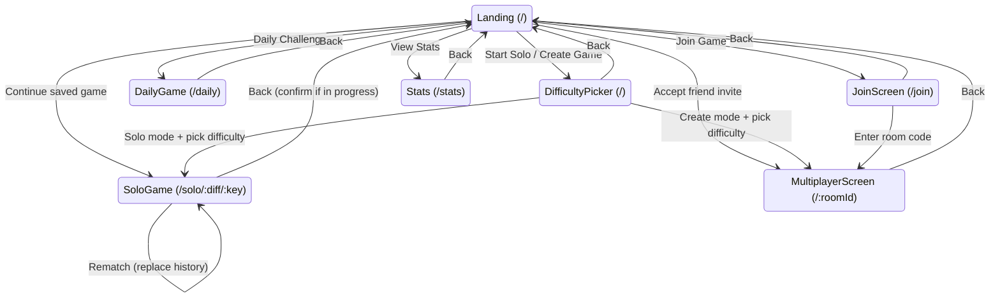
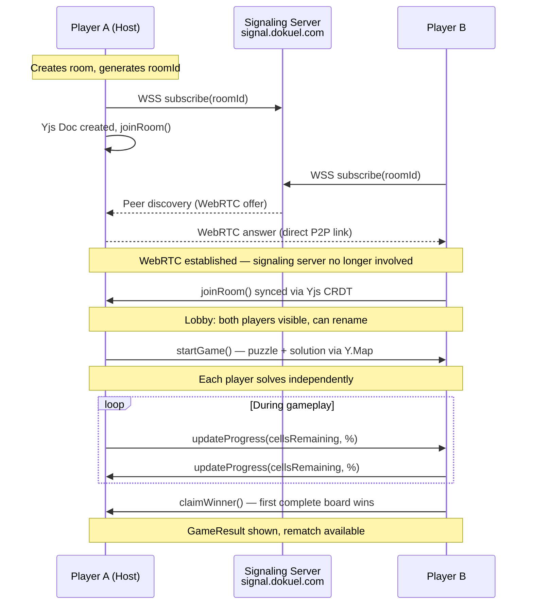
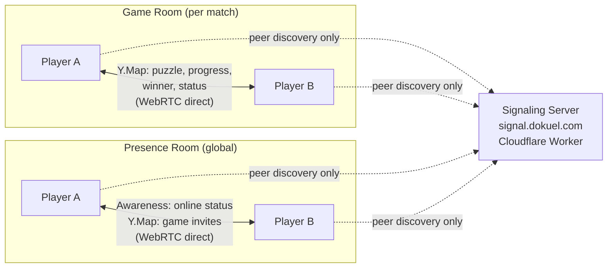
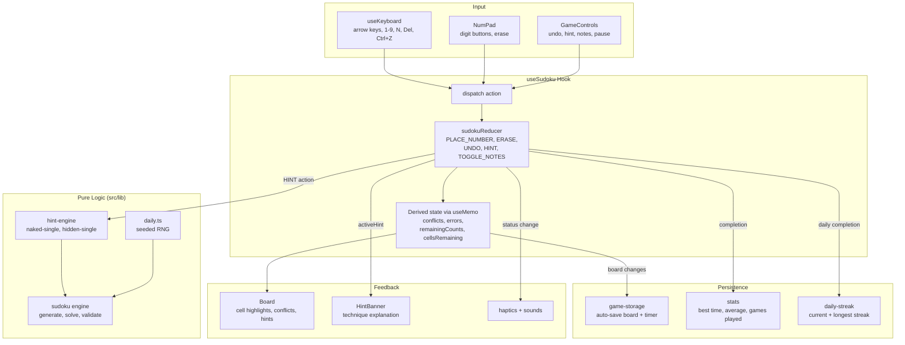

# Dokuel

1v1 sudoku duel — real-time, peer-to-peer, no account needed.

**[Play now at dokuel.com](https://dokuel.com)**

## Features

### Solo Play

- Four difficulty levels: Easy, Medium, Hard, Expert
- Pencil notes with a 3x3 mini-grid per cell (board ring indicator when active)
- Multi-level undo with move count badge
- Hint system — reveal one cell's correct value
- Pause with board overlay
- Three assist levels: Paper (no highlights), Standard (conflict highlighting + auto-clear notes), Full (conflicts + row/column highlighting)
- Auto-save — resume in-progress games across browser sessions
- Personal best time shown near timer; PB indicator on win
- Timer tracking with per-difficulty stats (best time, average, games played)
- Confetti celebration with haptic feedback, sound, and share button

### Daily Challenge

- Same puzzle for everyone, every day
- Deterministic generation via seeded RNG — same date, same board, any device
- Streak tracking with current/longest streak shown on landing page
- Progress indicator on landing page for in-progress daily puzzles

### 1v1 Multiplayer

- Peer-to-peer via WebRTC — no server needed, game state syncs directly between players
- Auto-generated fun player names (adjective + animal) with inline editing in lobby
- Create a room, share the link, race to solve the same puzzle
- Live opponent progress bar (cells remaining, completion %)
- 60-second disconnect countdown with option to claim win
- Rematch without leaving the room

### Friends

- Add friends via shareable friend code — no accounts needed
- See which friends are online in real time
- Send and receive game invites directly from the landing page
- One-tap join for pending invites

### Mobile-First UX

- Touch-optimized with 44px+ tap targets
- Haptic feedback (vibration patterns for place, erase, conflict, completion)
- Synthesized sound effects via Web Audio API (toggleable)
- Movable numpad — Bottom (default), Left, or Right — configurable via settings popover
- Safe area support for notched devices
- Dark mode with system preference detection + manual toggle

### Desktop Support

- Full keyboard controls: arrow keys to navigate, 1–9 to place, N for notes, Delete to erase, Ctrl+Z to undo
- Responsive side-by-side layout with board and numpad on wide screens

## Tech Stack

| Layer | Technology |
|-------|-----------|
| UI | React 19, Tailwind CSS 4 |
| Build | Vite, TypeScript, Bun |
| Multiplayer | Yjs CRDTs + y-webrtc (peer-to-peer WebRTC) |
| Signaling | Cloudflare Worker + Durable Objects |
| Testing | Vitest, React Testing Library, Playwright |
| Lint & Format | Biome |

## Getting Started

### Prerequisites

- [Bun](https://bun.sh/) (v1.0+)

### Install & Run

```bash
# Install dependencies
bun install

# Start the dev server
bun run dev
```

The app will be available at `http://localhost:5173`.

### Build for Production

```bash
bun run build
```

Output is written to `dist/`.

## Scripts

| Command | Description |
|---------|-------------|
| `bun run dev` | Start Vite dev server |
| `bun run build` | Production build |
| `bun run preview` | Preview production build locally |
| `bun run test` | Run tests once |
| `bun run test:watch` | Run tests in watch mode |
| `bun run lint` | Check lint + formatting |
| `bun run lint:fix` | Auto-fix lint + formatting |
| `bun run typecheck` | TypeScript type checking |
| `bun run ci` | Full CI pipeline (lint + typecheck + test) |
| `bun run screenshots` | Capture Playwright screenshots across 4 viewports |
| `bun run e2e` | Run all Playwright tests |

## Architecture

### Screen Navigation

URL-based routing with History API (no router library). Every path maps to a screen type.



### Multiplayer Lifecycle

The full flow from room creation through game completion, showing what data travels where.



### Multiplayer Network Topology

Two separate Yjs rooms serve different purposes. Game data never touches the server.



### Solo Game Data Flow

Shows how user input flows through the layered architecture to update the board and persist state.



### File Structure

```
src/
├── components/     # React UI components
│   ├── Board, Cell, NumPad, NumPadPositionToggle
│   ├── SoloGame, DailyGame, MultiplayerGame, MultiplayerBoard, MultiplayerScreen
│   ├── Landing, Lobby, JoinScreen, FriendsList
│   ├── GameLayout, GameControls, GameResult, HintBanner
│   ├── Stats, DifficultyPicker, AssistLevelPicker, Timer
│   ├── DarkModeToggle, SoundToggle, ToggleSwitch, Toast
│   └── App (router)
├── hooks/          # State management
│   ├── useSudoku, sudokuReducer, sudokuActions
│   ├── useYjsMultiplayer, usePresence
│   ├── useKeyboard, useNumPadPosition, useDarkMode
│   └── useAssistLevel, useOpponentProgressVisible
├── lib/            # Pure logic — no React dependency
│   ├── sudoku (engine), types, p2p-room (Yjs CRDT), room-code
│   ├── daily (seeded RNG), daily-streak, stats, game-storage
│   ├── hint-engine, hint-hidden-single
│   ├── friends, player-identity
│   └── name-generator, haptics, sounds, format, constants
```

### Key Design Decisions

- **Peer-to-peer multiplayer** — game state syncs via Yjs CRDTs over WebRTC. A self-hosted Cloudflare Worker at `signal.dokuel.com` handles peer discovery; all game data flows directly between players
- **React hooks only** — `useReducer` for game state, no external state library
- **Three-level assist system** — Paper (no assistance), Standard (conflict highlighting + auto-clear notes), Full (conflicts + row/column highlighting). Configurable at difficulty selection and during gameplay
- **Friends without accounts** — shareable friend codes, online presence via Yjs awareness, game invites from the landing page
- **No accounts** — auto-generated fun names (adjective + animal), persisted in localStorage; session identity in sessionStorage for reconnect
- **Colocated tests** — `*.test.ts` / `*.test.tsx` files sit next to the code they test

## License

[MIT](LICENSE)
